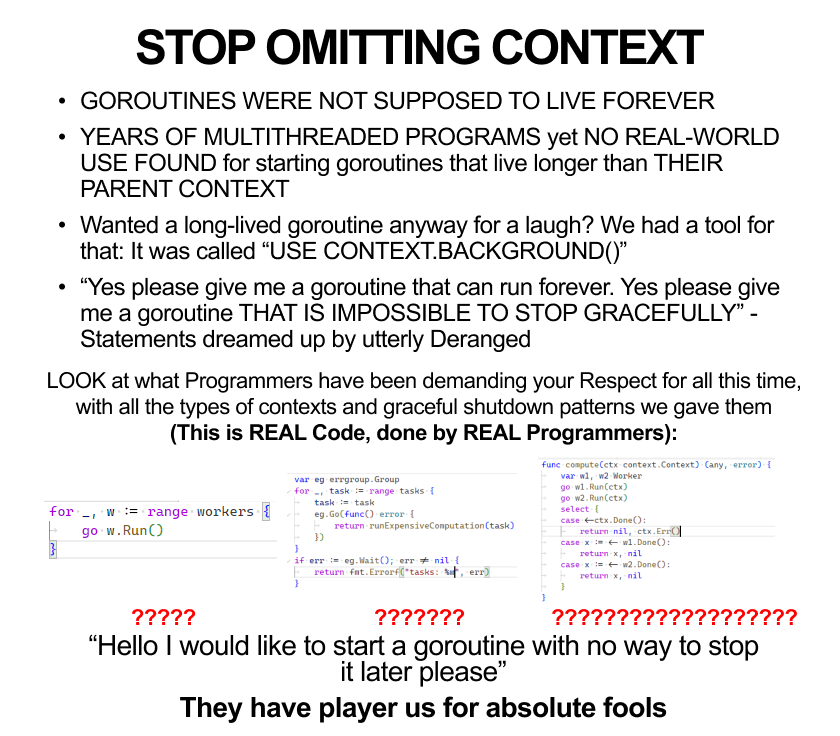

# Go: особенности написания конкурентных программ

- [Go: особенности написания конкурентных программ](#go-особенности-написания-конкурентных-программ)
  - [Мотивация написания статьи](#мотивация-написания-статьи)
  - [Горутины](#горутины)
    - [Определяйте для каждой горутины время ее жизни](#определяйте-для-каждой-горутины-время-ее-жизни)
    - [Управляйте scope созданных горутин](#управляйте-scope-созданных-горутин)
    - [Используйте корректный способ создания контекста](#используйте-корректный-способ-создания-контекста)
  - [Каналы](#каналы)
    - [Определяйте корректный размер буффера для каналов](#определяйте-корректный-размер-буффера-для-каналов)
    - [Определите корректное завершение читателей/писателей](#определите-корректное-завершение-читателейписателей)
  - [Общие данные](#общие-данные)
    - [Явно определяйте требования к конкурентному API](#явно-определяйте-требования-к-конкурентному-api)
    - [Знайте, как устроены map](#знайте-как-устроены-map)
  - [Пишите тесты](#пишите-тесты)

## Мотивация написания статьи

Всем нам предстоит поддерживать уже существующий код, а также проводить ревью кода коллег. Иногда становится очень тяжело видеть некоторые паттерны, которые кажутся безобидными, но при некорректном использовании или после неосторожного рефакторинга могут привести к различным проблемам:

1. утечке горутин и каналов
2. повреждению целостности структур данных
3. паникам
4. трудноуловимым багам в бизнес-логике
5. самому страшному - неутолимому желанию порефакторить код, который выглядит как то, что вы бы написали в первый день работы с Go

## Горутины

Одна из самых популярных фишек языка Go - это горутины. Зачастую новый проект не запускает горутины явно (с помощью `go ...`) с начала, однако потом обрастает дополнительной логикой, фоновыми воркерами, cron job-ами и т.п., а логику работы с запускаемыми горутинами никто детально не прорабатывает - работает же, чего еще нужно?

В последствие может выясниться, что запускаемые горутины не имеют способа остановки, а к проекту требуется добавить graceful shutdown, а горутины по большей части запускаются по принципу fire-and-forget, без возможности как-то повлиять на их выполнение после запуска.

### Определяйте для каждой горутины время ее жизни

Ограничить время жизни каждой запускаемой горутины можно с помощью `context.Context`, который будет передаваться в функцию в `go foo(ctx)` или захватываться по ссылке при использовании анонимной функции

```go
ctx, cancel := context.WithCancel(context.TODO())
defer cancel()

go func() {
    for {
        select {
            case <-ctx.Done():
                return
            default:
                // Do business logic here.
        }
    }
}()
```

При использовании сторонних библиотек, описании интерфейсов в своих библиотеках надо также стремиться к возможности прекратить выполнение горутины извне, например вместо

```go
type Runner interface {
    Run() error
}
```

можно использовать

```go
type Runner interface {
    Run(ctx context.Context) error
}
```

что позволит прерывать выполнение, отменяя переданный контекст.

Разумеется, `context.Context` - это не единственный способ ограничить время жизни горутины, а ограничение времени жизни горутины - не единственный способ использовать `context.Context`.



Для реализации долгоживущих фоновых задач можно также использовать два метода `Start() error` и `Stop() error`, без использования контекста ни в одном из них, что также может помочь ограничить время жизни горутин и в целом решает ту же проблему, но по-другому.

Однако, *как мне кажется*, передача контекста является более простым методом, особенно в тех случаях, когда запущенную горутину нужно именно прервать, особенно если она работает с каналами:

```go
func NewConsumer[T any](in <-chan T) Consumer[T] {
    return Consumer[T]{
        in: in,
    }
}

type Consumer[T any] struct {
    in <-chan T
}

func (c Consumer) Run(ctx context.Context) error {
    for {
        select {
            case <-ctx.Done():
                return ctx.Err();
            case v := <-c.in:
                // Do business logic here.
        }
    }
}
```

в то время как `Start/Stop` может подойти для выполнения какой-то дополнительной логики в `Stop` (закрытие соединения и т. п.), или когда предполагается, что место запуска и место остановки будут разнесены далеко друг от друга.

### Управляйте scope созданных горутин

```go
func takeFirst(ctx context.Context, options []any) any {
	ch := make(chan any)

	for i, opt := range options {
		i, opt := i, opt // Pass as params or create new vars in `for` scope.

		go func() {
			select { // Context done or time elapsed, whichever happens first.
			case <-ctx.Done():
				return
			case <-time.After(time.Second * time.Duration(i)):
				select { // Context done or channel write, whichever happens first.
				case <-ctx.Done():
					return
				case ch <- opt:
				}
			}
		}()
	}

	for first := range ch {
		return first
	}

	return nil // len(options) == 0.
}
```

Вызываем эту функцию вот так:

```go
func main() {
	ctx, cancel := context.WithCancel(context.Background())
	measureGoroutineNum()

	takeFirst(ctx, []any{1, 2, 3, 4, 5})
	measureGoroutineNum()

	cancel() // Will happen in far future, if at all.
	measureGoroutineNum()
}

func measureGoroutineNum() {
	time.Sleep(time.Second)
	fmt.Println(runtime.NumGoroutine())
}
```

Иииии... У нас `len(options)-1` (в данном случае 4) лишних запущенных горутин:

```output
1
5
1
```

Вроде как мы передали контекст, вышли из `takeFirst`, а горутины не завершились.

В подобных случаях, когда по контексту прерываются операции, которые актуальны только в рамках данной функции, необходимо явно создавать контекст, и передавать уже его:

```go
func takeFirst2(ctx context.Context, options []any) any {
	ctx, cancel := context.WithCancel(ctx)
	defer cancel()

	ch := make(chan any)

	for i, opt := range options {
		i, opt := i, opt // Pass as params or create new vars in `for` scope.

		go func() {
			select { // Context done or time elapsed, whichever happens first.
			case <-ctx.Done():
				return
			case <-time.After(time.Second * time.Duration(i)):
				select { // Context done or channel write, whichever happens first.
				case <-ctx.Done():
					return
				case ch <- opt:
				}
			}
		}()
	}

	for first := range ch {
		return first
	}

	return nil // len(options) == 0.
}
```

### Используйте корректный способ создания контекста

`context.Background()` нужен в тех случаях, когда создается новый контекст, по логике приложения не имеющий родительского контекста; когда задача действительно должна выполняться любое количество времени; или когда нам все равно, когда она завершится (можно ~~говнокодить и оправдываться этим~~ использовать при прототипировании или при написании маленьких программ или тестов).

`context.TODO()` используется тогда, когда в данном scope должен был быть родительских контекст, но его нет в силу исторических причин. `TODO` позволяет в будущем найти подобные места в коде и отрефакторить, корректно передавая контекст.

Таким образом, два разных способа создания пустых контекстов позволяют визуально определить, по какой причине контекст не имеет возможности отмены, таймаута или дедлайна. При рефакторинге кода и добавлении `ctx context.Context` в параметры функции (если такое произойдет) это также должно однозначно дать понять, следует ли заменить пустой контекст на родительский (`context.TODO()` должен заменяться на родительский, а с `context.Background()` потребуется дальнейший анализ, иначе можно ограничить время жизни того, что изначально задумывалось как что-то более долгоживущее, чем вызывающая функция).

## Каналы

### Определяйте корректный размер буффера для каналов

Небуферизованный канал - это просто неявная связь между читателями и писателями, в то время как буферизованный канал выполняет еще и роль хранилища данных.

Буферизованные каналы - это, в большинстве случаев, либо части работы, которые останутся в канале и не будут выполнены при аварийном завершении читателей, либо лишние части работы, которые были подготовлены и записаны писателями, но не будут востребованы читателями. В большинстве случаев буферизованные каналы можно заменить небуферизованными рефакторингом небольшого количества кода, что несильно скажется на читаемости кода в целом, однако значительно упростит восприятие роли и особенностей работы с каналом.

### Определите корректное завершение читателей/писателей

Небуферизованные и заполненные каналы будут блокировать операции записи/чтения, поэтому нужно потратить лишние усилия, чтобы убедиться, что какая-то горутина не залочится при записи/чтении навсегда.

Возьмем пример:

```go
func takeFirst(ctx context.Context, options []any) any {
	ch := make(chan any)

	for i, opt := range options {
		i, opt := i, opt // Pass as params or create new vars in `for` scope.

		go func() {
			select { // Context done or time elapsed, whichever happens first.
			case <-ctx.Done():
				return
			case <-time.After(time.Second * time.Duration(i)):
				select { // Context done or channel write, whichever happens first.
				case <-ctx.Done():
					return
				case ch <- opt:
				}
			}
		}()
	}

	for first := range ch {
		return first
	}

	return nil // len(options) == 0.
}
```

В данном примере каждая запись и чтение проводятся в блоке `select`, где в одной из ветви используется `case <-ctx.Done()`. Это позволяет горутинам гарантированно завершиться, если в результате их работы больше не нуждаются (если контекст отменен/истек).

Чтение из канала в `select` выполняется достаточно часто, однако не надо забывать, что и при записи в канал горутина может залочиться в ожидании читателя, который уже никогда не придет. Поэтому писать в канал можно всегда в `select`, используя ветку с контекстом для завершения работы горутины.

Приведенный пример тривиален, но часто встречаются и подобные случаи:

```go
func takeAll(ctx context.Context, options []any) []any {
	ctx, cancel := context.WithCancel(ctx)
	defer cancel()

	ch := make(chan any)

	for i, opt := range options {
		i, opt := i, opt // Pass as params or create new vars in `for` scope.

		go func() {
			select { // Context done or time elapsed, whichever happens first.
			case <-ctx.Done():
				return
			case <-time.After(time.Second * time.Duration(i)):
				select { // Context done or channel write, whichever happens first.
				case <-ctx.Done():
					return
				case ch <- opt:
				}
			}
		}()
	}

	var res []any
	for i := 0; i < len(options); i++ {
		select {
		case <-ctx.Done():
			return nil
		case v := <-ch:
			res = append(res, v)
		}
	}

	return res
}
```

Уберем первый `select`, и горутина может начать делать уже ненужную работу. Уберем второй - она может начать писать в канал, в то время как будет произведен выход из функции (контекст отменен или произошла паника). Уберем третий - горутина может начать читать из канала, в то время как одна или несколько горутин не записали значение в канал (контекст был отменен или в горутине произошла паника). Добавление всех трех `select` обеспечивает более корректную работу и, что может быть более важно, более корректное завершение работы всей функции.

## Общие данные

### Явно определяйте требования к конкурентному API

> Дисклеймер: данный раздел имеет плохо описанный и обоснованный пример кода.
>
> Я решил его оставить, т. к. хотел донести мысль о том, что важно давать понять коллегам (в том числе будущим, в том числе самому себе через год) как работает написанный конкурентный код. Еще лучше писать тесты для него.

Когда вы хотите обеспечить доступ к данным из нескольких горутин, недостаточно предоставить узкое API, надо еще описать, какие гарантии и режимы работы вы предоставляете. Код может корректно работать в некоторых случаях и некорректно - в других. Для проведения ревью и тестирования необходимо описать, какое поведение ожидается от нового функционала, а также потенциальные проблемы и gotchas при использовании.

Такой простейший код иллюстрирует проблему, когда автор задумал реализовать одно, читателю на ум может прийти совсем другое:

```go
func NewCachedValue[T any](initialValue T, refresh func() T) *CachedValue[T] {
	v := &CachedValue[T]{
		value:   atomic.Value{},
		enabled: atomic.Bool{},
		refresh: refresh,
		cancel:  nil,
	}
	v.Enable()

	return v
}

// CachedValue is a wrapper around a value of type T that automatically refreshes it every second.
type CachedValue[T any] struct {
	value   atomic.Value
	enabled atomic.Bool
	refresh func() T
	cancel  context.CancelFunc
}

// Get returns latest value.
func (v *CachedValue[T]) Get() T {
	return v.value.Load().(T)
}

// Enable turns on automatic refresh.
//
// It is safe to use concurrently, but not with Disable.
func (v *CachedValue[T]) Enable() {
	if v.enabled.Swap(true) {
		return // Already enabled.
	}

	// Setup cancellation for background refresh goroutine.
	ctx, cancel := context.WithCancel(context.Background())
	v.cancel = cancel

	go func() {
		timer := time.NewTimer(time.Second)
		for {
			select { // Context done or time to refresh, whichever happens first.
			case <-ctx.Done():
				return
			case <-timer.C:
				newValue := v.refresh()
				v.value.Store(newValue)
			}
		}
	}()
}

// Disable turns off automatic refresh.
//
// It is safe to use concurrently, but not with Enable.
func (v *CachedValue[T]) Disable() {
	if !v.enabled.Swap(false) {
		return // Already disabled.
	}

	if v.cancel == nil {
		panic("enabled CachedValue must have non-nil v.cancel")
	}

	v.cancel()
	v.cancel = nil // Remove reference to CancelFunc, that references Context, that may reference lots of things.
}
```

Вроде используются атомики, значит код автоматически concurrency-safe, и его можно использовать из любого числа горутин?

А вот и нет, можно вызывать только `Enable` или только `Disable` из любого числа горутин, а если вызывать из части горутин один метод, а из части - другой, то в определенный момент возникнет паника.

<details>
<summary>Тесты</summary>

```go
func TestCachedValueMustBeConcurrencySafe(t *testing.T) {
	t.Parallel()

	type mode string

	var (
		modeEnable  mode = "enable"
		modeDisable mode = "disable"
		modeRandom  mode = "random"
	)

	type testcase struct {
		goroutineNum int
		mode         mode
	}

	testcases := []testcase{
		{1, modeEnable},
		{2, modeEnable},
		{3, modeEnable},
		{1, modeDisable},
		{2, modeDisable},
		{3, modeDisable},
		{1, modeRandom},
		{2, modeRandom},
		{3, modeRandom},
	}

	for _, tt := range testcases {
		name := fmt.Sprintf("gorourines:%d, mode:%s", tt.goroutineNum, tt.mode)

		t.Run(name, func(t *testing.T) {
			v := cachedvalue.NewCachedValue(42, func() int {
				return 100
			})

			var wg sync.WaitGroup
			defer wg.Wait()

			wg.Add(tt.goroutineNum)
			for goroutine := 0; goroutine < tt.goroutineNum; goroutine++ {
				goroutine := goroutine

				go func() {
					defer wg.Done()

					switch tt.mode {
					case modeEnable:
						v.Enable()
					case modeDisable:
						v.Disable()
					case modeRandom:
						if goroutine%2 == 0 {
							v.Enable()
						} else {
							v.Disable()
						}
					}
				}()
			}
		})
	}
}
```

</details>

Другая проблема в том, что тяжело понять, задумывался ли такой код именно так, как получится; или это был лишь результат итеративной разработки, когда детали каких-то промежуточных решений забыли удалить, и они попали в финальную версию. Без постановки четких требований и написания тестов тяжело оценить, работает ли написанный код корректно.

### Знайте, как устроены map

Все знают, что при конкурентном доступе к общим участкам памяти (если хотя бы один из доступов - на запись) необходимо синхронизировать доступ во избежание возникновения гонок данных. Однако, при доступе к различным участкам памяти, пусть даже расположенным рядом, дополнительная синхронизация не требуется. Можно читать и писать значения в массиве по индексам, если разные горутины используют разные индексы для этого.

Также может возникнуть необходимость работать не с массивом, а с мапой, при чем разные горутины будут читать и писать значения с разными ключами. Синтаксически запись и чтение в мапу выглядит практически идентично работе с массивом, однако реализована совершенно по-другому, и при конкурентном доступе может привести к гонкам данных и повреждению структуры данных.

Дело в том, что по достижению определенного числа элементов мапа вынуждена расти, выделяя новые участки памяти под хранение как уже существующих, так и новых данных, куда данные постепенно переносятся для сохранения амортизированного времени доступа O(1). Из-за такой особенности работы мапы конкурентный доступ к ней на запись может приводить к некорректному перемещению внутренних данных, что в свою очередь может привести к возникновению трудновоспроизводимых багов и паник ([Go maps in action](https://go.dev/blog/maps), [Why are map operations not defined to be atomic?](https://go.dev/doc/faq#atomic_maps), [How the Go runtime implements maps efficiently (without generics)](https://dave.cheney.net/2018/05/29/how-the-go-runtime-implements-maps-efficiently-without-generics), [Are Go maps sensitive to data races?](https://dave.cheney.net/2015/12/07/are-go-maps-sensitive-to-data-races)). Конкурентное чтение из мапы безопасно, как и в случае с массивами.

Для конкурентного доступа к мапе, пусть даже по разным ключам, необходимо использовать либо мапу вместе с мьютексом, либо `sync.Map`, либо какую-либо типобезопасную обертку поверх `sync.Map`, что может быть лучше прямой работы с ней. Доступ к мапе напрямую из нескольких горутин совсем не аналогичен доступу к массиву и может привести к различным ошибкам в работе программы.

## Пишите тесты

Большинство условий гонки довольно легко обнаруживаются с помощью тестов, особенно при включенном детекторе гонок Go.

В целом, *я считаю*, что любой конкурентный код должен быть покрыт тестами, которые должны запускаться с включенным детектором гонок, т. к. такой код имеет огромное пространство для потенциальных трудноуловимых ошибок. Такой код должен быть при необходимости задокументирован (описаны гарантии и поддерживаемые способы использования) и быть подвергнут тщательному ревью, т. к. только ревью может помочь обнаружить крайние случаи, которые не были даже описаны или протестированы.
